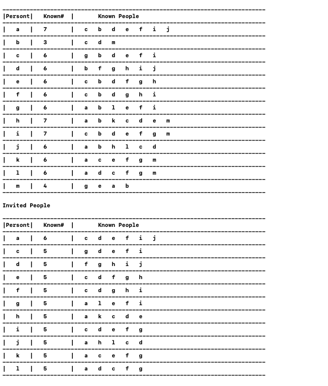
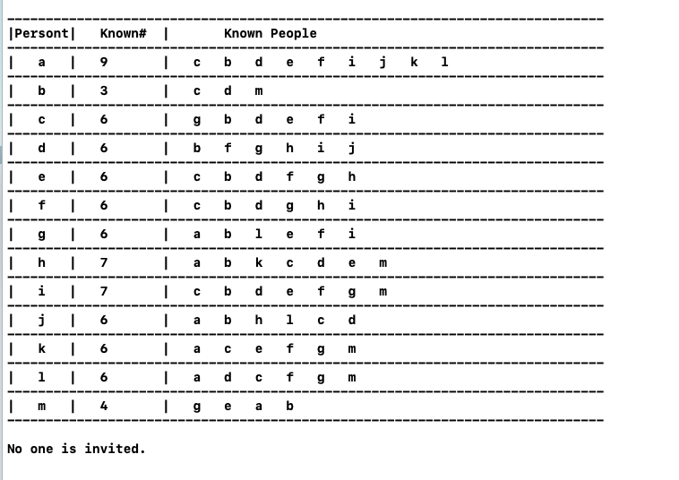

# Question 10
```
(Planning a party)
  Alice wants to throw a party and is deciding whom to call. She has n (which is at least 11) people
to choose from and she has made up a list of which pairs of these people know each other. She wants 
to invite as many people as possible subject to the following two constraints:
- Every person invited should know at least five other people that are invited
- Every person invited should not know at least five other people that are invited.
  Design an efficient algorithm for maximizing the number of people she can invite. Remember to 
analyze the running time and correctness.
  Hint: Maximizing the number of invitees is the same as minimizing the number of people Alice 
doesn’t invite. Obviously Alice might not be able to invite everyone. For example, if one of the
n people knows less than five people out of the n potential invitees then the first constraint can
never be satisfied for that person.
```

## Pseudocode

```cpp
mainFunction(list) {
1.  while(True) {
2.    for i <- list.begin() to list.end() {
3.      if degree(i) < 5 OR degree(i) > list.size() - 5 {
4.          remove(i) // removing a person
5.      }
6.    }
7.  }
8.}
```

## Analysis of Greedy approach

```
  1. Best Case , Everyone ( or Most of them ) satisfies both condtions.
  2. Average Case , Some of them satisfy both condtions.
  3. Worst Case , After removing some persons , no one satisfies any condtions.
  
  In worst case , No one is invited because after removing some persons , a new person
  turns up and does not satisfy the conditions.
  
  Since , Multimap is used for Data Struture.
  
  Inner for loop always runs n times. -> O(n)
  Counting degree takes O( log n )
  Removing a person takes O(n)
  
  Now , 
      For Best Case and Average Case ,
            Outer while loop runs constant times.
                  Time Compexity =   c -> constant time
                                     * O(n) -> for loop runs n times
                                     * O( log n ) -> counting degree
                                     * O(n) -> removing a Person
                                 =  O( n * n * log n)
        
       For Worst Case ,
            Outer while loop runs n times.
                  Time Compexity =   n -> n times
                                     * O(n) -> for loop runs n times
                                     * O( log n ) -> counting degree
                                     * O(n) -> removing a Person
                                 =  O( n * n * n * log n)
    
  Hence , Time Complexity is O( n * n * log n) for Best Case and Average Case
          and O( n * n * n * log n) for Worst Case.
```

# Screenshot to Question 10

## When Some People are Invited


## When None is Invited


