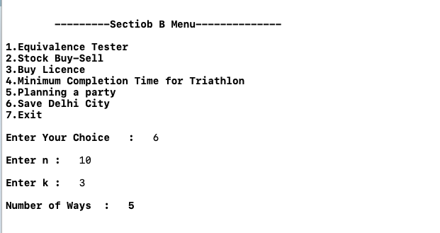

# Question 11
```
Save Delhi City

  Suppose you are Shaktimaan and you have decided to do something to save your favorite city (Delhi) 
against the attack of Tamraj Kilvish, since no one else surprisingly seems bothered about it, and are 
just suffering through various attacks by various different creatures.

  Seeing your passion , N people of Delhi decided to come forward to try their best in saving their 
city. Now you have decided to strategize these N people into a formation of AT LEAST K people in a 
group. Otherwise, that group won't survive.

  Let's demonstrate this by an example. Let's say that there were 10 people, and each group required 
at least 3 people in it for its survival. Then, the following 5 groups can be made:

- 10 - Single group of 10 members.
- 7 , 3 - Two groups. One consists of 7 members, the other one of 3 members.
- 6 , 4 - Two groups. One consists of 6 members, the other one of 4 members.
- 5 , 5 - Two groups. One consists of 5 members, the other one of 5 members.
- 4 , 3 , 3 - Three groups. One consists of 4 members, the other two of 3 members.

  Given the value of N, and K - find out the number of ways you can form these groups (anti-squads) 
to save Delhi city.

```

## Pseudocode

```cpp
saveDelhiCity( N , K ) {
1.  if N < K AND N > 0 {
2.    return 0
3.  }
4.  else if N == 0 {
5.    return 1
6.  }
7.  else {
8.    return saveDelhiCity( N - K , K ) + saveDelhiCity( N , K + 1)
9.  }
10.}
```

## Analysis of Recursive approach
```
  Since , The problem is solved using recursion so we can write the function using following equation
        T( n , k ) = T(n - k , k) + T ( n , k + 1 )
        T( 0 )     = 1
  After Solving the above recurive equation ,
        T( n , k ) = O( 2^ ( n / k ) )
  Hence , Time Complexity is O( 2^ ( n / k ) ).
```

## Screenshot to Question 11

