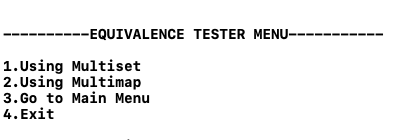
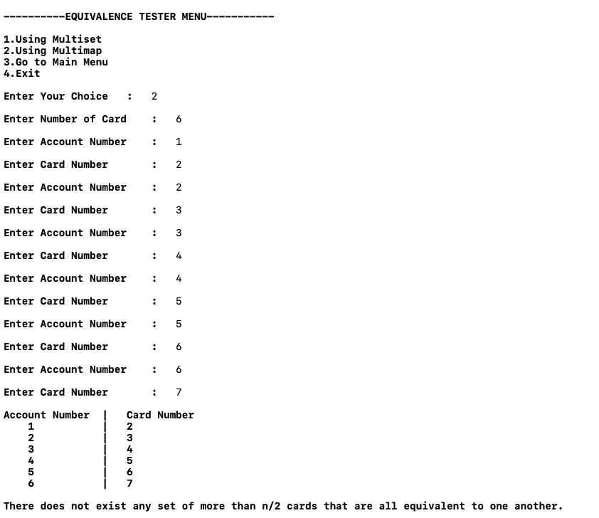
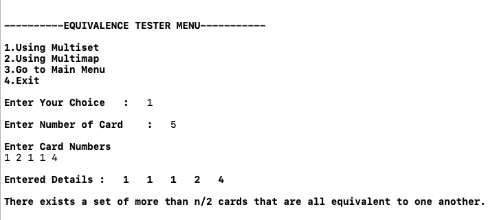

# Question 6
```
    Suppose you’re consulting for a bank that’s concerned about fraud detection, and they come 
to you with the following problem. They have a collection of n bank cards that they’ve 
confiscated, suspecting them of being used in fraud. Each bank card is a small plastic object,
containing a magnetic stripe with some encrypted data, and it corresponds to a unique account 
in the bank. Each account can have many bank cards corresponding to it, and two bank cards are 
equivalent if they correspond to the same account. It’s very difficult to read the account number 
of a bank card directly, but the bank has a high-tech equivalence tester that takes two bank cards 
and, after performing some computations, determines whether they are equivalent.

   Their question is the following: among the collection of n cards, is there a set of more 
than n/2 of them that are all equivalent to one another? Assume that the only feasible 
operations you can do with the cards are to pick two of them and plug them in to the 
equivalence tester. Show how to decide the answer to their question with only O(n log n) 
invocations of the equivalence tester.
```
## Pseudocode

### Using Multimap

```cpp
equivalenceTester(multimap) {
1.  for i <- multimap.begin() to multimap.end() {
2.    if multimap.count(i) > multimap.size()/2 {
3.      return true
4.    }
5.  }
6.  return false
7. }     
```

### Using Multiset

```cpp
equivalenceTester(multiset) {
1.  for i <- multiset.begin() to multiset.end() {
2.    if multiset.count(i) > multiset.size()/2 {
3.      return true
4.    }
5.  }
6.  return false
7. } 
```

### Analysis of Code for both Psuedocodes [ Time Complexity ]
```
  for loop starts at step one and ends at step 7.
  It'll run n time.
  and count will take O( log n ) and so as size.
  
  Total Time complexity -> n times O ( log n) 
                        -> O( n log n )
  Time Taken by Both Data Strutures are O(n log n)
```


### Screenshot to Main Function of Program


### Screenshot of Multimap Part

```
When More than n/2 Equivalent Cars exist
```


```
When More than n/2 Equivalent Cards don't exist
```



### Screenshot of Multiset Part

```
When More than n/2 Equivalent Cards exist
```



```
When More than n/2 Equivalent Cards don't exist
```


### Instructions to Run the Code
- for Multiset , enter Card details
- for Multimap , enter card details as well as account number
