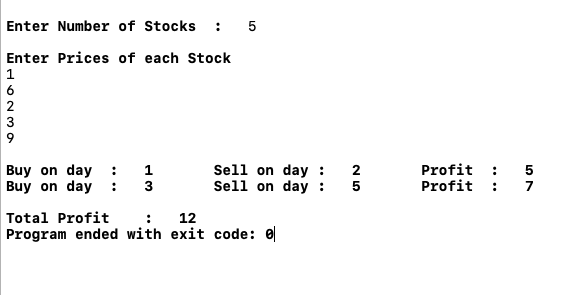

# Question 7
```
   You are consultant working for a small computation-intensive investment company, and 
they have the following type of problem they want to solve over and over. A typical 
instance of the problem is the following. They are doing a simulation in which they 
look at n consecutive days of a given stock, at some point in the past. Let’s number 
the days i = 1,2, . . . , n; for each day i, they have a price p(i) per share for the 
stock on that day (For simplicity, the price was same during each day). 

   Suppose during this time period, they wanted to buy 1000 shares on some day and sell 
all these shares on some (later) day. They want to know: When should they have bought 
and when should they have sold in order to have made as much money as possible. (If 
there was no way to make money during the n days, you should report this instead).

   For example, suppose n = 3 , p(1) = 9 , p(2) = 1 , p(3) = 5. Then you should return 
Buy on day 2 and selling on day 3 means that they would have made $4 per share.

   Show how to find the correct numbers i and j in time O(n log n).
   
```

## Pseudocode
```cpp
stockBuySell(price) {
1.  N <- lenghth[price] 
2.  Create An Array solution[ 0 , 1 , ... , N/2 + 1 ] of structure buy-sell
3.  while i < N - 1 {
4.         while i < N-1 AND price[i+1] <= price[i] {
5.              i <- i + 1
6.         }
7.         if i == N - 1 {
8.            break
9.         }
10.        i <- i + 1
11.        solution[countSol].buy = i
12.        while i < N AND  price[i] >= price[i-1] {
13.            i <- i + 1
14.        }
15.        solution[countSol].sell = i-1;
16.    }
17.  return solution // to print solutions
```

### Analysis of Code [ Time Complexity ]

```
  outer while loop -> from step 3 to 16 runs n times
  inner while loop1 -> from step 4 to step 6 runs 
                                              -> constant times in Best Case 
                                              -> constant times in Average Case 
                                              -> n times in Worst Case
  step 7 to step 11 -> takes constant time                                           
  inner while loop2 -> from step 12 to step 14 runs
                                              -> constant times in Best Case 
                                              -> constant times in Average Case 
                                              -> n times in Worst Case
                                              
                                              
  Now Finding Time Complexity ,
      Outer While loop always runs n - 1 times.
      
      For Best and Average Cases , Both inner while loops take constant time
              T(n) = ( n - 1 ) * O(1)
              T(n) = (n - 1) * c
              T(n) = O(n)
              
      For Worst Case , 1st inner while loop runs n times because price array contains 
      data in decreasing order.
      
      Decreasing order or Almost decreasing order is the worst case for this algorithm.
              T(n) = ( n - 1 ) * n
              T(n) = O(n^2)
  
  Hence , Time Complexity is O(n) for Best and Average Cases and O(n^2) for Worst Cases.
          and Space Complexity is O(n)
```


### Here's screenshot of console.



## Another Approach - Using Divide and Conquer Technique
```
Since , the above algorithm is taking O(n^2) time in worst case but it's optimal solutions and 
it gives maximum profit out of given stocks.

Here's another divide and conquer approach which returns two indexes from given price array to 
maximize profit but this algorihtm does not always give maximum profit.
```

### Pseudocode
```cpp
1. End <- Length[price]
2. start <- 1
3. stockBuySell(Price , Start , End) {
4.      if Start == End {
5.         return
6.      }
7.      (i1,j1) := stockBuySell(price , 1 , End/2 )
8.      (i2,j2) := stockBuySell(price , End/2 + 1 , End)
9.      Let price(i) be minimal in 1 , 2 , 3 , ... , End/2
10.     Let price(j) be maximal in End/2 + 1, End/2 + 2 , ... , End
11.     return (i,j)
12. }
```

### Analysis of Divide and Conquer approach 
```
  step 7 divides the price array in left half -> to find minimal
  step 8 divides the price array in right half -> to find maximal
  step 7 and step 8 run until Start and End will be same 
    -> Both of them will take O( log n )
  step 9 finds minimal in left half , it will take linear time.
  step 10 finds maximal in right half , it will also take linear time.
  
  Finding Minimal from left half and Maximal from right half will give
  maximum profit.
  
  O(n) -> find maximal 
  O(n) -> find minimal
  O(log n ) -> dividing price array into subparts to find maximal and minimal
  So Total Time Complexity =  [ n + n ] * [ log n + log n ]
                           =  4 * n * log n
                           =  O( n log n )
                           
  Hence , Divide and Conquer Approach takes O(n log n ) time but it will give only
  one buying index and one selling index.
```
