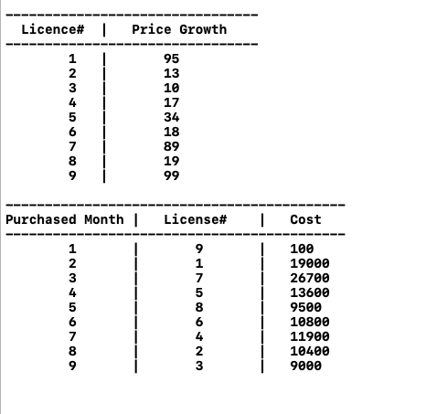

# Question 8
```
  Your friends are starting a security company that needs to obtain licenses for n different pieces of
cryptographic software. Due to regulations, they can only obtain these licenses at the rate of at 
most one per month. Each license is currently selling for a price of $100 . However, they are all 
becoming more expensive according to exponential growth curves: in particular, the cost of license j 
increases by a factor of r(j) greater than 1 each month, where r(j) is a given parameter. This means 
that if license j is purchased t months from now, it will cost 100*r(j)[t]. We will assume that all 
the price growth rates are distinct; that is **r(i) ≠ r(j) for license i ≠ j (even though they start 
at the same price of $100).

  The question is that: Given that the company can only buy at most one license a month, in which 
order should it buy the license so that the total amount of money it spends is as small as possible.

  Give an algorithm that takes the n rates of price growth r(1) , r(2) , . . . , r(n) and computes 
an order in which to buy the license so that the total amount of spent is minimized. The running time 
of the algorithm should be polynomial in n.
```

## Pseudocode
```cpp
/*
    priceGrowth is 2D Matrix in which there's two columns. 1st column is for licence number and 
   2nd column is for price growth value.
*/
mainFunction(priceGrowth){
1.  N <- number of Rows of priceGrowth
2.  sort priceGrowth Matrix in decreasing order according to price growth value
3.  month <- 1
4.  for i <- 0 to N {
5.    buy priceGrowth[ i , 0 ] licence in month# with priceGrowth[ i , 1 ]*month*100 amount
6.    month <- month + 1
7.  }
8. }
```

## Analysis of Greedy approach
```
  The above problem is solved in greedy approach. In which , we need to minimize total amount 
to buy all licence so we choose highest price growth licence number first , then 2nd highest
and so on...
Now , 
  step 2 <- it takes O(n log n ) because STL sort is used.
  step 4 to step 7 runs n times -> O(n)
  Total Time Complexity = O(n log n ) + O(n)
                        = O(n log n )
                        
Hence , Time Complexity is O(n log n ).                       
```


## Screenshot to Question 8

