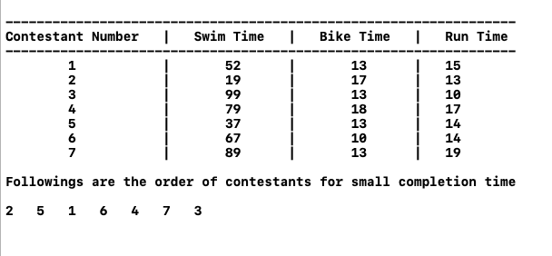

# Question 9
```
   Your friend is working as a camp counselor, and you are in charge of organizing activities for a set 
of junior-high-school-age campers. One of his plans is the following mini-triathlon exercise: each 
contestant must swim 20 laps of a pool, then bike 10 miles, and then run 3 miles. The plan is to send 
the contestants out in a staggered fashion, via the following rule: the contestants must use the pool 
one at a time. In other words, first one contestant swims the 20 laps, gets out, and starts biking. 
As soon as this first person is out of the pool, a second contestant begins swimming the 20 laps; as 
soon as he/she's out and starts biking, a third contestant begins swimming... and so on.)

   Each contestant has a projected swimming time (the expected time it will take him or her to complete
the 20 laps), a projected biking time (the expected time it will take him or her to complete the 10 
miles of bicycling), and a projected running time (the time it will take him or her to complete the 
3 miles of running). Your friend wants to decide on a schedule for the triathalon: an order in which to
sequence the starts of the contestants. Let's say that the completion time of a schedule is the earliest 
time at which all contestants will be finished with all three legs of the triathalon, assuming they each 
spend exactly their projected swimming, biking, and running times on the three parts. (Again, note that 
participants can bike and run simultaneously, but at most one person can be in the pool at any time.)

   What's the best order for sending people out, if one wants the whole competition to be over as early
as possible? More precisely, give an efficient algorithm that produces a schedule whose completion time 
is as small as possible.
```

## Pseudocode
```cpp
  /*  
        triathlonData is a 2D Matrix in which there's 4 columns.
            1st column -> Contestant Number
            2nd column -> Swimming Time
            3rd column -> Biking Time
            4th column -> Running Time
  */
mainFunction(triathlonData) {
1.   N <- Number of Rows in triathlonData
2.   sort triathlonData Matrix according to Swimming time in increasing order
3.   for i <- 0 to N {
4.     send triathlonData[ i , 0 ] Contestant to Minimize Completion Time
5.   }
6. }
```

## Analysis of Greedy approach
```
   The above problem is solved in greedy approach. In which , we need to minimize Completion time.
 Since at most one person can be in the pool at any time so we choose that contestant first who 
 finish swimming first. In Order to choosing earliest swim time first , we can minimize completion
 time because there won't be any collision in the pool.
 
 Now , 
    step 2 takes O(n log n ) to sort
    step 3 to step 5 runs n times -> O(n)
    Total Time Complexity = O(n log n ) + O(n)
                          = O(n log n )
                          
 Hence , Time Complexity is O(n log n ).                         
```

## Screenshot to Question 9

