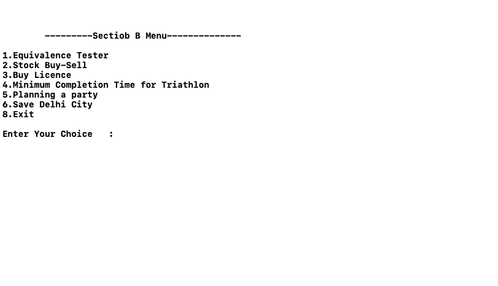

# Section B

## How to Run Code

User needs to download all the files and just execute **main.cpp** file. All the file should be in same directory.

## Screenshot when User runs main.cpp
  

## Questions and Analysis Part

<details>
<summary>Question 6</summary>

```
    Suppose you’re consulting for a bank that’s concerned about fraud detection, and they come 
to you with the following problem. They have a collection of n bank cards that they’ve 
confiscated, suspecting them of being used in fraud. Each bank card is a small plastic object,
containing a magnetic stripe with some encrypted data, and it corresponds to a unique account 
in the bank. Each account can have many bank cards corresponding to it, and two bank cards are 
equivalent if they correspond to the same account. It’s very difficult to read the account number 
of a bank card directly, but the bank has a high-tech equivalence tester that takes two bank cards 
and, after performing some computations, determines whether they are equivalent.

   Their question is the following: among the collection of n cards, is there a set of more 
than n/2 of them that are all equivalent to one another? Assume that the only feasible 
operations you can do with the cards are to pick two of them and plug them in to the 
equivalence tester. Show how to decide the answer to their question with only O(n log n) 
invocations of the equivalence tester.
```
## Pseudocode

### Using Multimap

```cpp
equivalenceTester(multimap) {
1.  for i <- multimap.begin() to multimap.end() {
2.    if multimap.count(i) > multimap.size()/2 {
3.      return true
4.    }
5.  }
6.  return false
7. }     
```

### Using Multiset

```cpp
equivalenceTester(multiset) {
1.  for i <- multiset.begin() to multiset.end() {
2.    if multiset.count(i) > multiset.size()/2 {
3.      return true
4.    }
5.  }
6.  return false
7. } 
```

### Analysis of Code for both Psuedocodes [ Time Complexity ]
```
  for loop starts at step one and ends at step 7.
  It'll run n time.
  and count will take O( log n ) and so as size.
  
  Total Time complexity -> n times O ( log n) 
                        -> O( n log n )
  Time Taken by Both Data Strutures are O(n log n)
```

### Instructions to Run the Code
- for Multiset , enter Card details
- for Multimap , enter card details as well as account number

<br>
</details>
<br>


<details>
<summary>Question 7</summary>

```
   You are consultant working for a small computation-intensive investment company, and 
they have the following type of problem they want to solve over and over. A typical 
instance of the problem is the following. They are doing a simulation in which they 
look at n consecutive days of a given stock, at some point in the past. Let’s number 
the days i = 1,2, . . . , n; for each day i, they have a price p(i) per share for the 
stock on that day (For simplicity, the price was same during each day). 

   Suppose during this time period, they wanted to buy 1000 shares on some day and sell 
all these shares on some (later) day. They want to know: When should they have bought 
and when should they have sold in order to have made as much money as possible. (If 
there was no way to make money during the n days, you should report this instead).

   For example, suppose n = 3 , p(1) = 9 , p(2) = 1 , p(3) = 5. Then you should return 
Buy on day 2 and selling on day 3 means that they would have made $4 per share.

   Show how to find the correct numbers i and j in time O(n log n).
   
```

## Pseudocode
```cpp
stockBuySell(price) {
1.  N <- lenghth[price] 
2.  Create An Array solution[ 0 , 1 , ... , N/2 + 1 ] of structure buy-sell
3.  while i < N - 1 {
4.         while i < N-1 AND price[i+1] <= price[i] {
5.              i <- i + 1
6.         }
7.         if i == N - 1 {
8.            break
9.         }
10.        i <- i + 1
11.        solution[countSol].buy = i
12.        while i < N AND  price[i] >= price[i-1] {
13.            i <- i + 1
14.        }
15.        solution[countSol].sell = i-1;
16.    }
17.  return solution // to print solutions
```

### Analysis of Code [ Time Complexity ]

```
  outer while loop -> from step 3 to 16 runs n times
  inner while loop1 -> from step 4 to step 6 runs 
                                              -> constant times in Best Case 
                                              -> constant times in Average Case 
                                              -> n times in Worst Case
  step 7 to step 11 -> takes constant time                                           
  inner while loop2 -> from step 12 to step 14 runs
                                              -> constant times in Best Case 
                                              -> constant times in Average Case 
                                              -> n times in Worst Case
                                              
                                              
  Now Finding Time Complexity ,
      Outer While loop always runs n - 1 times.
      
      For Best and Average Cases , Both inner while loops take constant time
              T(n) = ( n - 1 ) * O(1)
              T(n) = (n - 1) * c
              T(n) = O(n)
              
      For Worst Case , 1st inner while loop runs n times because price array contains 
      data in decreasing order.
      
      Decreasing order or Almost decreasing order is the worst case for this algorithm.
              T(n) = ( n - 1 ) * n
              T(n) = O(n^2)
  
  Hence , Time Complexity is O(n) for Best and Average Cases and O(n^2) for Worst Cases.
          and Space Complexity is O(n)
```

## Another Approach - Using Divide and Conquer Technique
```
Since , the above algorithm is taking O(n^2) time in worst case but it's optimal solutions and 
it gives maximum profit out of given stocks.

Here's another divide and conquer approach which returns two indexes from given price array to 
maximize profit but this algorihtm does not always give maximum profit.
```

### Pseudocode
```cpp
1. End <- Length[price]
2. start <- 1
3. stockBuySell(Price , Start , End) {
4.      if Start == End {
5.         return
6.      }
7.      (i1,j1) := stockBuySell(price , 1 , End/2 )
8.      (i2,j2) := stockBuySell(price , End/2 + 1 , End)
9.      Let price(i) be minimal in 1 , 2 , 3 , ... , End/2
10.     Let price(j) be maximal in End/2 + 1, End/2 + 2 , ... , End
11.     return (i,j)
12. }
```

### Analysis of Divide and Conquer approach 
```
  step 7 divides the price array in left half -> to find minimal
  step 8 divides the price array in right half -> to find maximal
  step 7 and step 8 run until Start and End will be same 
    -> Both of them will take O( log n )
  step 9 finds minimal in left half , it will take linear time.
  step 10 finds maximal in right half , it will also take linear time.
  
  Finding Minimal from left half and Maximal from right half will give
  maximum profit.
  
  O(n) -> find maximal 
  O(n) -> find minimal
  O(log n ) -> dividing price array into subparts to find maximal and minimal
  So Total Time Complexity =  [ n + n ] * [ log n + log n ]
                           =  4 * n * log n
                           =  O( n log n )
                           
  Hence , Divide and Conquer Approach takes O(n log n ) time but it will give only
  one buying index and one selling index.
```

<br>
</details>
<br>


<details>
<summary>Question 8</summary>

```
  Your friends are starting a security company that needs to obtain licenses for n different pieces of
cryptographic software. Due to regulations, they can only obtain these licenses at the rate of at 
most one per month. Each license is currently selling for a price of $100 . However, they are all 
becoming more expensive according to exponential growth curves: in particular, the cost of license j 
increases by a factor of r(j) greater than 1 each month, where r(j) is a given parameter. This means 
that if license j is purchased t months from now, it will cost 100*r(j)[t]. We will assume that all 
the price growth rates are distinct; that is **r(i) ≠ r(j) for license i ≠ j (even though they start 
at the same price of $100).

  The question is that: Given that the company can only buy at most one license a month, in which 
order should it buy the license so that the total amount of money it spends is as small as possible.

  Give an algorithm that takes the n rates of price growth r(1) , r(2) , . . . , r(n) and computes 
an order in which to buy the license so that the total amount of spent is minimized. The running time 
of the algorithm should be polynomial in n.
```

## Pseudocode
```cpp
/*
    priceGrowth is 2D Matrix in which there's two columns. 1st column is for licence number and 
  2nd column is for price growth value.
*/
mainFunction(priceGrowth) {
1.  N <- number of Rows of priceGrowth
2.  sort priceGrowth Matrix in decreasing order according to price growth value
3.  month <- 1
4.  for i <- 0 to N {
5.    buy priceGrowth[ i , 0 ] licence in month# with priceGrowth[ i , 1 ]*month*100 amount
6.    month <- month + 1
7.  }
8. }
```

## Analysis of Greedy approach
```
  The above problem is solved in greedy approach. In which , we need to minimize total amount 
to buy all licence so we choose highest price growth licence number first , then 2nd highest
and so on...
Now , 
  step 2 <- it takes O(n log n ) because STL sort is used.
  step 4 to step 7 runs n times -> O(n)
  Total Time Complexity = O(n log n ) + O(n)
                        = O(n log n )
                        
Hence , Time Complexity is O(n log n ).                       
```

<br>
</details>
<br>

<details>
<summary>Question 9</summary>

```
   Your friend is working as a camp counselor, and you are in charge of organizing activities for a set 
of junior-high-school-age campers. One of his plans is the following mini-triathlon exercise: each 
contestant must swim 20 laps of a pool, then bike 10 miles, and then run 3 miles. The plan is to send 
the contestants out in a staggered fashion, via the following rule: the contestants must use the pool 
one at a time. In other words, first one contestant swims the 20 laps, gets out, and starts biking. 
As soon as this first person is out of the pool, a second contestant begins swimming the 20 laps; as 
soon as he/she's out and starts biking, a third contestant begins swimming... and so on.)

   Each contestant has a projected swimming time (the expected time it will take him or her to complete
the 20 laps), a projected biking time (the expected time it will take him or her to complete the 10 
miles of bicycling), and a projected running time (the time it will take him or her to complete the 
3 miles of running). Your friend wants to decide on a schedule for the triathalon: an order in which to
sequence the starts of the contestants. Let's say that the completion time of a schedule is the earliest 
time at which all contestants will be finished with all three legs of the triathalon, assuming they each 
spend exactly their projected swimming, biking, and running times on the three parts. (Again, note that 
participants can bike and run simultaneously, but at most one person can be in the pool at any time.)

   What's the best order for sending people out, if one wants the whole competition to be over as early
as possible? More precisely, give an efficient algorithm that produces a schedule whose completion time 
is as small as possible.
```

## Pseudocode
```cpp
  /*  
        triathlonData is a 2D Matrix in which there's 4 columns.
            1st column -> Contestant Number
            2nd column -> Swimming Time
            3rd column -> Biking Time
            4th column -> Running Time
  */
mainFunction(triathlonData) {
1.   N <- Number of Rows in triathlonData
2.   sort triathlonData Matrix according to Swimming time in increasing order
3.   for i <- 0 to N {
4.     send triathlonData[ i , 0 ] Contestant to Minimize Completion Time
5.   }
6. }
```

## Analysis of Greedy approach
```
   The above problem is solved in greedy approach. In which , we need to minimize Completion time.
 Since at most one person can be in the pool at any time so we choose that contestant first who 
 finish swimming first. In Order to choosing earliest swim time first , we can minimize completion
 time because there won't be any collision in the pool.
 
 Now , 
    step 2 takes O(n log n ) to sort
    step 3 to step 5 runs n times -> O(n)
    Total Time Complexity = O(n log n ) + O(n)
                          = O(n log n )
                          
 Hence , Time Complexity is O(n log n ).                         
```

<br>
</details>
<br>

<details>
<summary>Question 10</summary>

```
(Planning a party)
  Alice wants to throw a party and is deciding whom to call. She has n (which is at least 11) people
to choose from and she has made up a list of which pairs of these people know each other. She wants 
to invite as many people as possible subject to the following two constraints:
- Every person invited should know at least five other people that are invited
- Every person invited should not know at least five other people that are invited.
  Design an efficient algorithm for maximizing the number of people she can invite. Remember to 
analyze the running time and correctness.
  Hint: Maximizing the number of invitees is the same as minimizing the number of people Alice 
doesn’t invite. Obviously Alice might not be able to invite everyone. For example, if one of the
n people knows less than five people out of the n potential invitees then the first constraint can
never be satisfied for that person.
```

## Pseudocode

```cpp
mainFunction(list) {
1.  while(True) {
2.    for i <- list.begin() to list.end() {
3.      if degree(i) < 5 OR degree(i) > list.size() - 5 {
4.          remove(i) // removing a person
5.      }
6.    }
7.  }
8.}
```

## Analysis of Greedy approach

```
  1. Best Case , Everyone ( or Most of them ) satisfies both condtions.
  2. Average Case , Some of them satisfy both condtions.
  3. Worst Case , After removing some persons , no one satisfies any condtions.
  
  In worst case , No one is invited because after removing some persons , a new person
  turns up and does not satisfy the conditions.
  
  Since , Multimap is used for Data Struture.
  
  Inner for loop always runs n times. -> O(n)
  Counting degree takes O( log n )
  Removing a person takes O(n)
  
  Now , 
      For Best Case and Average Case ,
            Outer while loop runs constant times.
                  Time Compexity =   c -> constant time
                                     * O(n) -> for loop runs n times
                                     * O( log n ) -> counting degree
                                     * O(n) -> removing a Person
                                 =  O( n * n * log n)
        
       For Worst Case ,
            Outer while loop runs n times.
                  Time Compexity =   n -> n times
                                     * O(n) -> for loop runs n times
                                     * O( log n ) -> counting degree
                                     * O(n) -> removing a Person
                                 =  O( n * n * n * log n)
    
  Hence , Time Complexity is O( n * n * log n) for Best Case and Average Case
          and O( n * n * n * log n) for Worst Case.
```

<br>
</details>
<br>

<details>
<summary>Question 11</summary>

```
Save Delhi City

  Suppose you are Shaktimaan and you have decided to do something to save your favorite city (Delhi) 
against the attack of Tamraj Kilvish, since no one else surprisingly seems bothered about it, and are 
just suffering through various attacks by various different creatures.

  Seeing your passion , N people of Delhi decided to come forward to try their best in saving their 
city. Now you have decided to strategize these N people into a formation of AT LEAST K people in a 
group. Otherwise, that group won't survive.

  Let's demonstrate this by an example. Let's say that there were 10 people, and each group required 
at least 3 people in it for its survival. Then, the following 5 groups can be made:

- 10 - Single group of 10 members.
- 7 , 3 - Two groups. One consists of 7 members, the other one of 3 members.
- 6 , 4 - Two groups. One consists of 6 members, the other one of 4 members.
- 5 , 5 - Two groups. One consists of 5 members, the other one of 5 members.
- 4 , 3 , 3 - Three groups. One consists of 4 members, the other two of 3 members.

  Given the value of N, and K - find out the number of ways you can form these groups (anti-squads) 
to save Delhi city.

```

## Pseudocode

```cpp
saveDelhiCity( N , K ) {
1.  if N < K AND N > 0 {
2.    return 0
3.  }
4.  else if N == 0 {
5.    return 1
6.  }
7.  else {
8.    return saveDelhiCity( N - K , K ) + saveDelhiCity( N , K + 1)
9.  }
10.}
```

## Analysis of Recursive approach
```
  Since , The problem is solved using recursion so we can write the function using following equation
        T( n , k ) = T(n - k , k) + T ( n , k + 1 )
        T( 0 )     = 1
  After Solving the above recurive equation ,
        T( n , k ) = O( 2^ ( n / k ) )
  Hence , Time Complexity is O( 2^ ( n / k ) ).
```

<br>
</details>
<br>

## For More Details About Each Question
- [Question 6](https://github.com/shoaibrayeen/Algorithms/tree/master/ASSIGNMENTS_MCA_3RD_SEM/Section%20B/Q6)
- [Question 7](https://github.com/shoaibrayeen/Algorithms/tree/master/ASSIGNMENTS_MCA_3RD_SEM/Section%20B/Q7)
- [Question 8](https://github.com/shoaibrayeen/Algorithms/tree/master/ASSIGNMENTS_MCA_3RD_SEM/Section%20B/Q8)
- [Question 9](https://github.com/shoaibrayeen/Algorithms/tree/master/ASSIGNMENTS_MCA_3RD_SEM/Section%20B/Q9)
- [Question 10](https://github.com/shoaibrayeen/Algorithms/tree/master/ASSIGNMENTS_MCA_3RD_SEM/Section%20B/Q10)
- [Question 11](https://github.com/shoaibrayeen/Algorithms/tree/master/ASSIGNMENTS_MCA_3RD_SEM/Section%20B/Q11)
