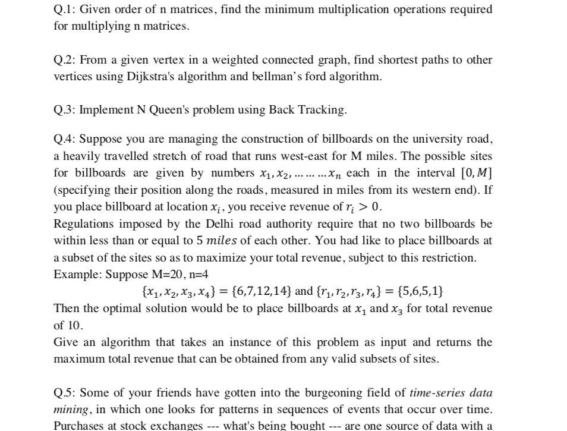
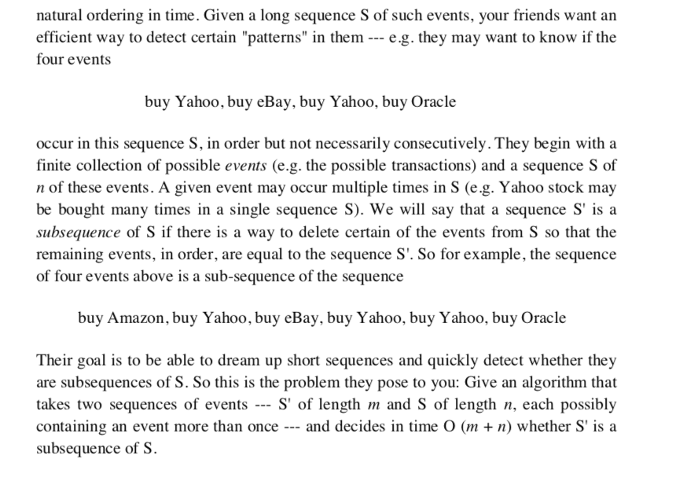
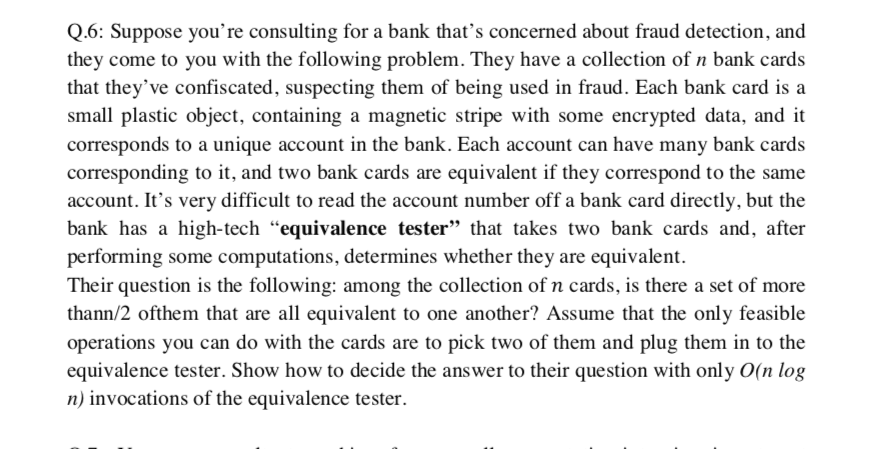
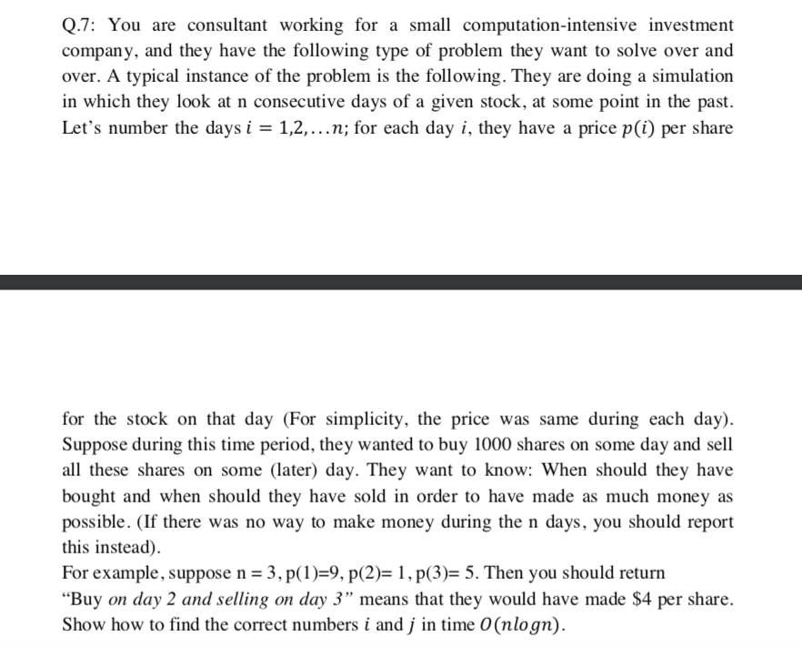
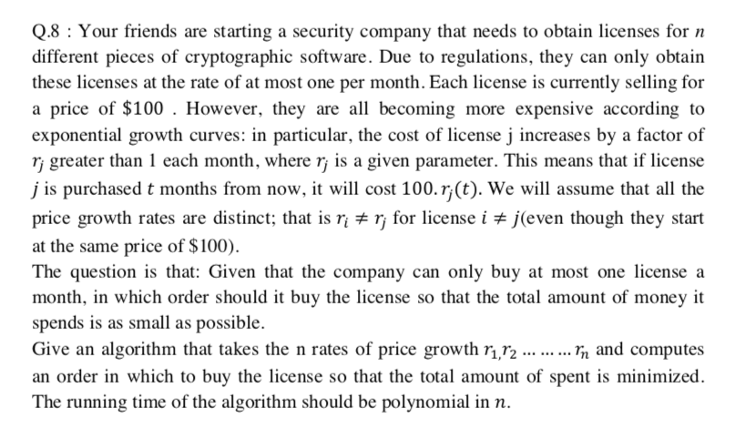
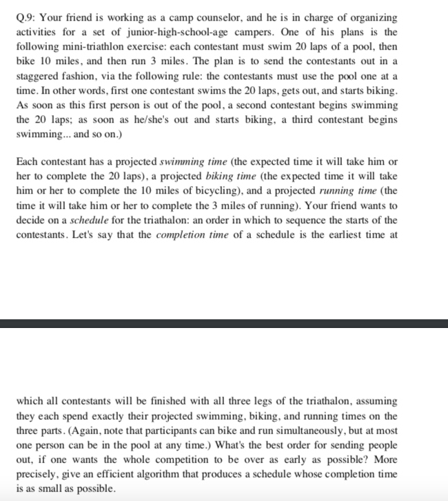
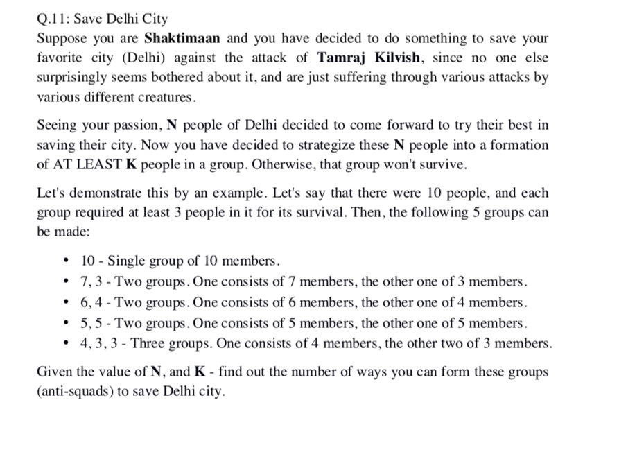

# Assignment Finished and Submitted on 17th November'18

## Questions

## Solution of Questions :
- [Question 1](https://github.com/shoaibrayeen/Algorithms/tree/master/ASSIGNMENTS_MCA_3RD_SEM/Section%20A/Q1)
- [Question 2](https://github.com/shoaibrayeen/Algorithms/tree/master/ASSIGNMENTS_MCA_3RD_SEM/Section%20A/Q2)
- [Question 3](https://github.com/shoaibrayeen/Algorithms/tree/master/ASSIGNMENTS_MCA_3RD_SEM/Section%20A/Q3)
- [Question 4](https://github.com/shoaibrayeen/Algorithms/tree/master/ASSIGNMENTS_MCA_3RD_SEM/Section%20A/Q4)
- [Question 5](https://github.com/shoaibrayeen/Algorithms/tree/master/ASSIGNMENTS_MCA_3RD_SEM/Section%20A/Q5)
- [Question 6](https://github.com/shoaibrayeen/Algorithms/tree/master/ASSIGNMENTS_MCA_3RD_SEM/Section%20B/Q6)
- [Question 7](https://github.com/shoaibrayeen/Algorithms/tree/master/ASSIGNMENTS_MCA_3RD_SEM/Section%20B/Q7)
- [Question 8](https://github.com/shoaibrayeen/Algorithms/tree/master/ASSIGNMENTS_MCA_3RD_SEM/Section%20B/Q8)
- [Question 9](https://github.com/shoaibrayeen/Algorithms/tree/master/ASSIGNMENTS_MCA_3RD_SEM/Section%20B/Q9)
- [Question 10](https://github.com/shoaibrayeen/Algorithms/tree/master/ASSIGNMENTS_MCA_3RD_SEM/Section%20B/Q10)
- [Question 11](https://github.com/shoaibrayeen/Algorithms/tree/master/ASSIGNMENTS_MCA_3RD_SEM/Section%20B/Q11)
